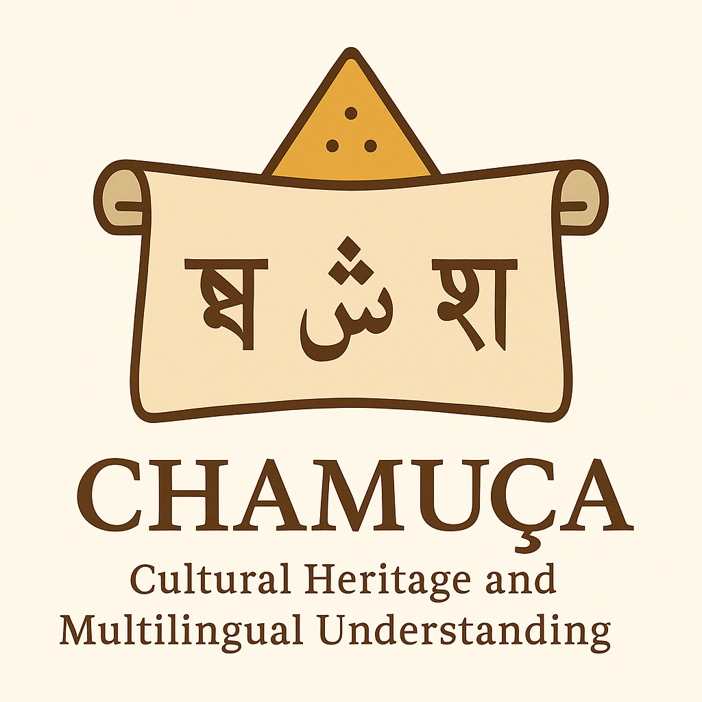
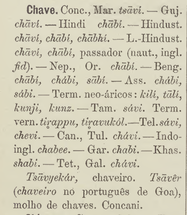

# Cultural HeritAge and Multilingual Understanding through lexiCal Archives (CHAMUÇA)
<div align="center">

</div>

## Table of Contents
- [Summary](#summary)
- [Introduction](#introduction)
- [Background](#background)
- [CHAMUÇA as an open, crowd-resourced dataset](#chamu%C3%A7a-as-an-open-crowd-resourced-dataset)
- [Adding a language to CHAMUÇA](#adding-a-language-to-chamu%C3%A7a)
- [References](#references)
- [Contact](#contact)

## Summary 
The current document describes the Chamuça project, its aim and the current state of its progress. It will also describe the language resource of the same name, which is one of the products of the project, how it is structured and how to access it. It also provides information on how to contribute to the project and the resource. 


## Introduction 

**Cultural HeritAge and Multilingual Understanding through lexiCal Archives (CHAMUÇA)** is an interdisciplinary collaboration in the area of historical contact linguistics which aims to document the impact of the Portuguese on the languages of Asian languages, while also making earlier scholarship and research on this topic more accessible and easier to use.  

As well as being the name of our project, CHAMUÇA is also the name of the language resource which is produced through this collaboration. This language resource will be published in successive versions as a linguistic knowledge graph in RDF, making it a test case for the use of **linguistic linked data** in disseminating this kind of cultural and linguistic information.  And, of course, the name of our project also evokes, chamuça, the fried snack which is a well known example of intercultural culinary exchange.

At the time of writing (20/11/25), we have a first version of CHAMUÇA which describes Portuguese borrowings in Urdu, Hindi and Punjabi.  In the first stage of the project we are focusing on South Asian languages and Malaysian/Indonesian but would like to add languages covering a wider area in the future. 

The aims of the project are as follows: 
- Help to make this part of history better known in an accessible machine actionable form, in our case by creating a knowledge graph of Portuguese borrowings into Asian languages with separate lexicons for each language and a indexical Portuguese lexicon
- Model this graph in RDF using the OntoLex-Lemon model and and make it accessible via a SPARQL endpoint; publish it with an open license and add it to the linguistic linked open data cloud,
- Bring together relevant lexical information on this topic from different sources, including Wiktionary, Wikipedia, and making reference to lexicographic information, but in particular Dalgado's 1913 work.
- Extract the relevant details from Dalgado's lexicon and compare it/combine it with information from the above resources, helping to make Dalgado's important scholarship more accessible to modern day researchers as well as a wider public 

## Background
### The Impact of Portuguese in Asia
The influence of the Portuguese language in Asia starts with the so-called Age of Discovery (_Era dos Descobrimentos_ in Portuguese) during the 15th and 16th centuries. In this period, sailors and colonists from the kingodm of Portugal were able to establish a network of colonies and trading posts along the South Asian coast, beginning with the Malabar coast in India, and including locations such as Cochin and Calicut. 

Over time, these footholds expanded into a wider system of settlements and trade routes spanning many parts of ths content. One inevitable consequence of this expansion was that **Portuguese emerged as a key language of trade and diplomacy in Asia** To quote Cardoso (2016) “A língua portuguesa encaixou-se na região asiática ao ponto de se converter em importante língua franca de comérico e diplomacia” [The Portuguese language became deeply rooted in the Asian region to the extent that it evolved into an important lingua franca for commerce and diplomacy]. 

The Portuguese language began to exert a significant influence on the languages of Asia—starting on the western coast of what is now India, spreading to Sri Lanka, Bengal, and then further east to Indonesia, China, and Japan. This linguistic impact is still very much present today, even if it's not always recognized by speakers of these languages.

The idea behind CHAMUçA then is to make this story both more visible and more accessible—both to researchers and to a wider public. That is, we intend to trace the ongoing legacy of colonisation and trade as reflected in the vocabularies of modern Asian languages, drawing on both contemporary and historical scholarship in the field.  Another aim of Chamuça is also to bring awareness to the pioneering work of the early 20th century scholar Sebastião Rodolfo Dalgado. 


## Dalgado and the _Influência do Vocabulário Português em Línguas Asiáticas_
Sebastian Rodolfo Dalgado was a Portuguese Catholic priest, linguist, and orientalist born in Assagão, Goa, in 1855—then a Portuguese colony. Deeply rooted in both Indo-Portuguese and Catholic traditions, Dalgado became one of the most prominent figures in the study of Lusophone linguistic influence in Asia. His scholarly trajectory bridged European philological methods with a nuanced understanding of local Asian languages and cultures.

Dalgado's most significant scholarly contribution lies in his pioneering work on lexical borrowings from Portuguese into Asian languages. At a time when the linguistic impact of European colonial powers in Asia was poorly documented, Dalgado's research opened a new field of study: _Luso-Asian contact linguistics_.

### Languages Covered by Dalgado's Lexicon
Dalgado's work covers the following (we use Soares' names for these languages, translated from the original Portuguese of Dalgado):  

[Achinese or Atjeh](https://www.wikidata.org/wiki/Q34447),  [Anglo-Indian](https://www.wikidata.org/wiki/Q56725),  [Annamite or Annamese](https://www.wikidata.org/wiki/Q9192),  [Arabic](https://www.wikidata.org/wiki/Q56475),  [Assamese](https://www.wikidata.org/wiki/Q29401),  [Balinese](https://www.wikidata.org/wiki/Q33025),  [Batavian](https://www.wikidata.org/wiki/Q49228),  [Batta or Batak](https://www.wikidata.org/wiki/Q33070),  [Bengali](https://www.wikidata.org/wiki/Q9610),  [Bugui](https://www.wikidata.org/wiki/Q3507951),  [Burmese](https://www.wikidata.org/wiki/Q9228),  [Chinese](https://www.wikidata.org/wiki/Q7850),  [Dayak](https://www.wikidata.org/wiki/Q58494757),  [Galoli](https://www.wikidata.org/wiki/Q551569),  [Garo](https://www.wikidata.org/wiki/Q35756),  [Gujarati](https://www.wikidata.org/wiki/Q5137),  [Hindi](https://www.wikidata.org/wiki/Q1568),  [Hindustani](https://www.wikidata.org/wiki/Q11051)*,  [Indo-French](https://www.wikidata.org/wiki/Q16992183),  [Japanese](https://www.wikidata.org/wiki/Q5287),  [Javanese](https://www.wikidata.org/wiki/Q33549),  [Kambojan](https://www.wikidata.org/wiki/Q9205),  [Kanarese](https://www.wikidata.org/wiki/Q33673),  [Kashmiri](https://www.wikidata.org/wiki/Q33552),  [Khassi](https://www.wikidata.org/wiki/Q33578),  [Konkani](https://www.wikidata.org/wiki/Q33946),  [Laskhari-Hindustani](https://www.wikidata.org/wiki/Q11051),  [Macassar](https://www.wikidata.org/wiki/Q33614),  [Madurese](https://www.wikidata.org/wiki/Q33723),  [Malagasy](https://www.wikidata.org/wiki/Q7930),  [Malay](https://www.wikidata.org/wiki/Q9237),  [Malayalam](https://www.wikidata.org/wiki/Q36236),  [Marathi](https://www.wikidata.org/wiki/Q1571),  [Molucan](https://www.wikidata.org/wiki/Q33475),  [Nepali](https://www.wikidata.org/wiki/Q33823),  [Nicobarese](https://www.wikidata.org/wiki/Q702939),  [Oriya](https://www.wikidata.org/wiki/Q33810),  [Panjabi](https://www.wikidata.org/wiki/Q58635),  [Persian](https://www.wikidata.org/wiki/Q9168),  [Pidgin-English](https://www.wikidata.org/wiki/Q42365),  [Rabbinical](https://www.wikidata.org/wiki/Q178440),  [Siamese](https://www.wikidata.org/wiki/Q9217),  [Sindhi](https://www.wikidata.org/wiki/Q33997),  [Sinhalese](https://www.wikidata.org/wiki/Q13267),  [Sundanese](https://www.wikidata.org/wiki/Q34002),  [Tamil](https://www.wikidata.org/wiki/Q5885),  [Telugu](https://www.wikidata.org/wiki/Q8097),  [Teto](https://www.wikidata.org/wiki/Q3547832),  [Tibetan](https://www.wikidata.org/wiki/Q34271),  [Tonkinese](https://www.wikidata.org/wiki/Q9192),  [Tulu](https://www.wikidata.org/wiki/Q34211),  [Turkish](https://www.wikidata.org/wiki/Q256).  

*By Hindustani Dalgado refers to what we nowadays call Urdu. To quote Dalgado (in Soares' translation): "It is true that both terms Urdu and Hindustani are used promiscuously, but Urdu denotes properly speaking, the form of the literary language, purer and more polished, and Hindustani, the common speech diluted by the admixture of exotic words".

## CHAMUÇA as an open, crowd-resourced dataset
The CHAMUÇA project took inspiration from the linguistic scholarship carried out by Dalgado with the aim of making this scholarship more accessible both to human beings and to machines. Indeed, our goal is not only to make Dalgado's work in this area accessible to a wider audience (including non-specialists), but to do the same thing for other scholarship in this area. Much of the scholarship that has been carried out in what we have termed Luso-Asian contact linguistics is only available in Portuguese or only in other languages and often only in paper format. And much of it is available in scattered resources ('silos'), without a single access point, and often in a format that is diffcult to process and not interoperable with other relevant resources.  

Overall then, our goals in initiating the project were the following: 
- Make Dalgado's work accessible in a machine readable form, as a **Findable Accesssible Interoperable and Reusable** (FAIR) dataset[^1] using already existing standards and technologies whenever possible and with an open license; part of this is a publication of Dalgado's lexicon as a (proof checked) Wikisource edition;
- Add entries not
- We also aim to enrich Dalgado's work by comparing it with other lexicographic and scholarly resources; we would also eventually open like to open up our resource up to crowdsourcing;
- We were also interested in seeing how such a resource could be made available via linked data, which we see as a fitting technology which is potentially very suitable for this task (we describe this in the following section).

In a first stage of the project we would like to work on the following languages (due to the expertise of the initial partecipants to the project):
**Bengali, Gujarati, Hindi, Urdu, Indonesian, Konkani, Malay, Panjabi, Sinhalese, Tamil, Telegu.**

### CHAMUÇA as Linguistic Linked Open Data 
In this section we describe the motivations for making the data available as linked open data[^2]. The principal idea was to ensure that our resource would born FAIR and that it would be machine actionable.  We were also keen to make sure our data was open as possible; for this reason we publish everything with a CC-BY license. In addition, we wanted to profit from the many other advantages of the linked data format, including:
- The possibility to make our data available publically via a SPARQL endpoint;
- The natural fit of a graph-based data model to represent the information in our dataset;
- The possibility of using pre-existing standards and technologies in the Semantic Web stack along with the semantic artifacts such as OntoLex-Lemon.

#### Architecture of the CHAMUÇA Language Resource

<div align="center">

</div>
As the preceeding diagram shows the architecture of CHAMUÇA is fairly simple. CHAMUÇA as a Lexical Resource is a container containing a Portuguese lexicon (in OntoLex) and (OntoLex) lexica for each of the different languages being described. The Portuguese lexicon acts as an index (in the same way as in the original Dalgado lexicon). Each entry in the other lexica is related to a (hypothesised) Portuguese etymon via the etymological root property. 
For each Portuguese entry we include the following information:


| Category | Description |
| -------- | ------- |
| Headword | Lemma in word in question (using original alphabet(s)) |
| Transliteration | A transliteration of the lemma |
| Pronunciation | The pronunciation of the word in IPA |
| Etymology Free | A string describing the etymological origin of the Portuguese word (see below) |
| Dalgado | The lemmas as they appear in Dalgado's vocabulary (if different from the lemma which we use)|
| Part of Speech | The part of speech of the entry |
| Gender | The gender of the word (in cases where relevant) |
| Grammar | Additional grammatical information, e.g., in the case of nouns the singular and plural forms |
| Definition | Definition of the word |
| Wiktionary | A link to a corresponding wiktionary entry (if it exists)|
| Domain | The domain to which the word belongs |


For the other languages we include the following information:


| Category | Description |
| -------- | ------- |
| Etymon pt-PT | One or more original Portuguese etymons | 
| Headword | Lemma in word in question (using original alphabet(s)) |
| Transliteration | A transliteration of the lemma |
| Pronunciation | The pronunciation of the word in IPA |
| Etymology Free | A string describing the etymological origin of the word (see below)|
| Dalgado | The lemmas as they appear in Dalgado's work (if they appear there) |
| Part of Speech, Gender, etc | Standard grammatical information |
| Wiktionary | A link to a corresponding wiktionary entry (if it exists)|
| Example | An example sentence using the word |
| Source | Source of the word (as borrowed from Portuguese) |
| Domain | The domain to which the word belongs |
| Synonyms | Synonymous words |
| Grammar | Additional grammatical information |

Note that in the case of Hindi and Urdu we also include a link to the corresponding entry in the other language. 

#### Use of the OntoLex-Lemon Vocabulary

In this section we will describe how we use the OntoLex vocabulary to encode our language resource. 
We will show how an entry is encoded using the example of the Portuguese word _chave_ 'key' and its reflexes in Hindi and Urdu.
<div align="center">

</div>

The lexical information for the Portuguese etymon is derived from various sources, including Wiktionary. 
So for instance the entry for _chave_ is as follows:

```turtle
:chave_entry a ontolex:LexicalEntry,
        ontolex:Word ;
    lexinfo:gender lexinfo:feminine ;
    lexinfo:partOfSpeech lexinfo:commonNoun ;
    ontolex:canonicalForm :chave_lemma ;
    ontolex:lexicalForm :chave_plural ;
    ontolex:sense :chave_sense_1 .

:chave_lemma a ontolex:Form ;
    lexinfo:number lexinfo:singular ;
    ontolex:writtenRep "chave"@pt .

:chave_sense_1 a ontolex:LexicalSense ;
    skos:definition "objeto usado para abrir e fechar uma fechadura, algemas ou cadeado" ;
    ontolex:isSenseOf :chave_entry .
```
The Hindi reflex of the word, चाबी (cābī), is encoded as follows:

```turtle
:चाबी_entry a ontolex:LexicalEntry;
    lexinfo:etymologicalRoot <http://lari-datasets.ilc.cnr.it/chamuca_pt_lex#chave> ;
    lexinfo:etymology "pt chave (Source: Dalgado) ." ;
    lexinfo:gender lexinfo:feminine ;
    lexinfo:partOfSpeech lexinfo:commonNoun ;
    rdfs:seeAlso <http://lari-datasets.ilc.cnr.it/chamuca_ur_lex#چابی_entry> ;
    ontolex:canonicalForm :चाबी_lemma ;
    ontolex:lexicalForm :चाबियो_vp_form_चाबी,
        :चाबियों_op_form_चाबी,
        :चाबी_dp_form_चाबी,
        :चाबी_os_form_चाबी,
        :चाबी_vs_form_चाबी ;
    ontolex:sense :चाबी_sense .

:चाबी_lemma a ontolex:Form ;
    lexinfo:case lexinfo:directCase ;
    lexinfo:number lexinfo:singular ;
    ontolex:phoneticRep "t͡ʃɑː.biː"@hi-fonipa ;
    ontolex:writtenRep "चाबी"@hi-Deva,
        "cābī"@hi-Latn .

:चाबी_sense a ontolex:LexicalSense ;
    skos:definition "key" ;
    ontolex:isSenseOf :चाबी_entry .

```

The Urdu reflex of the word, چابی (cābī), is encoded as follows:

<pre dir="ltr"><code class="language-turtle">
:چابی_entry a ontolex:LexicalEntry,
        ontolex:Word ;
    lexinfo:domain &lt;https://lari-datasets.ilc.cnr.it/chadoms#nan&gt; ;
    lexinfo:etymologicalRoot &lt;https://lari-datasets.ilc.cnr.it/chamuca_pt_lex#chave_entry&gt; ;
    lexinfo:etymology "chave (Source: Dalgado)" ;
    lexinfo:gender lexinfo:feminine ;
    lexinfo:partOfSpeech lexinfo:commonNoun ;
    rdfs:seeAlso :चाबी_entry ;
    frac:frequency [ a frac:Frequency ;
            rdf:value 1799 ;
            frac:observedIn :urTenTen18 ] ;
    ontolex:canonicalForm :چابی_lemma ;
    ontolex:sense :چابی_sense .

:چابی_lemma a ontolex:Form ;
    lexinfo:case lexinfo:directCase ;
    lexinfo:number lexinfo:singular ;
    ontolex:phoneticRep "t͡ʃɑː.biː"@ur-fonipa ;
    ontolex:writtenRep "چابی"@ur-Arab,
        "cābī"@ur-Latn .
        

:چابی_sense a ontolex:LexicalSense ;
    skos:definition "key (object for opening and closing a lock)" ;
    ontolex:isSenseOf :چابی_entry .
</code></pre>


#### Encoding Etymological Information as Strings

One of the innovative aspects of our encoding of the etymologies using strings that adhere to a regular language. Below we give a brief account of these strings. Further details can be found in Khan et. al (2025). 

Etymologies trace the history of words over time and lend themselves well to representation as graph-like structures. However, modelling them as RDF graphs can become complicated  because:
- They  contain temporal information describing word evolution through given historical periods. This often calls for the  explicit modelling of time
- Multiple competing etymologies often exist for the same word, necessitating the  representation of uncertainty and alternative scholarly hypotheses.
- Academic usage  requires the modelling  of citations to the scholarly literature, to other lexical  sources, and corpora
Taken together these  requirements can lead to a substantial overhead in the number of RDF triples needed (and often lots of confusing reification), potentially making a ‘deep’ modelling of etymologies unwieldy in some cases.

However, etymologies can often be modelled using  a more ‘shallow’ approach so imposing a conceptual model designed for more  complicated cases might discourage users dealing with simpler cases. At the same time, a simpler conceptual model will inevitably fail to capture many common aspects of etymologies that researchers need.

At the same time having multiple conceptual models—a shallow and a deeper one—for etymologies would only add to the existing confusion, creating fragmentation rather than standardization.
 
Our idea was to develop a regular language allowing for a shallow representation of etymologies as structured strings.  This would enable us to extract etymological information using regular expressions via SPARQL queries/basic text processing scripts. Such an approach would be complementary to a conceptual model for representing them as RDF graphs  (such as that proposed by Khan 2018). This would allow for a  hybrid approach allowing for  the best of both worlds.

Our goal was to define a regular language that captures salient etymological information within strings.  We were guided by the following considerations:
- The language should (as far as possible) follow established printed conventions for representing etymologies, making it intuitive for lexicographers and researchers already familiar with traditional notation systems.
- Etymological strings can be associated with lexical entries, senses, or forms via an already existing  lexinfo datatype property, namely, etymology, helping to ensuring seamless integration with existing frameworks.
- Information can be extracted through SPARQL queries for integrated analysis or offline string processing using standard libraries. 


Our etymological string language incorporates several key features designed to balance expressiveness with simplicity, ensuring both human readability and machine processability.
- Multiple alternative etymologies can coexist in a single string, separated by the | symbol, allowing representation of competing scholarly theories without nesting complexity.
- Each etymological step is clearly separated by a > symbol, creating an intuitive left-to-right progression through historical development.
- Individual steps follow the pattern: language code form1, form2...formk 'sense1' & 'sense2'...& 'sensel', providing comprehensive linguistic information.
- Additional specification of each step can be provided through transition notes enclosed in square brackets [...], capturing important etymological processes.
CHAMUÇA serves as an ideal proving ground for our encoding system, as it encompasses the complexity of actual lexicographic research while remaining manageable enough to demonstrate practical applicability.
These examples from CHAMUÇA demonstrate how our encoding captures complex etymological relationships spanning multiple languages and historical periods.

Proto-Indo-European to Portuguese: October
```turtle
ine-pro *h₃(e)ḱtéh₃ 'eight', *h₃ḱt(e)h₃-uó- 'eighth' >
 itc-pro *oktō 'eight', *oktāwo- 'eighth' (Source: de Vaan) >
  la octō + -ber 'pertaining the eigth (month)' [analogy with la september 'september'] (Source: Ernout-Meillet) >
   pt outubro (Source: Wiktionary)|
en October (Source: McGregor)

```
Multiple Alternative Sources: Anise
```turtle
pt ? anis (Source: Dalgado) |
grc ἄνισον 'anise (Pimpinella anisum)' (Source: Dalgado) |
grc ἄνισον (Source: Wiktionary) > la anisum 'anise (Pimpinella anisum)' (Source: Dalgado)

```
Cross-Linguistic Borrowing: Lamp
```turtle
pt ? candil (Source: Dalgado) |
lat candēla 'a light made of wax or tallow' >
 grc κανδήλη 'oil lamp' >
  ar قنديل 'lamp' (Source: Dalgado)

```
Complex Alternative Pathways: Shirt
```turtle
pt camisa (Source: Dalgado) |
ar قميص 'shirt' & 'gown' (Source:Wiktionary) >
 fa قمیص (Source: Wiktionary) |
lat camisia (Source:Wiktionary) >
 ar قميص 'shirt' & 'gown' (Source: Dalgado)

```
#### Accessing the CHAMUÇA SPARQL Endpoint

The SPARQL endpoint can be accessed [here](https://anasfkhan81.github.io/chamuca_lexical_resource/).


## Adding a language to CHAMUÇA

The idea is for each language to have the following information for each potential Portuguese borrowing. 

| Category | Description |
| -------- | ------- |
| Etymon pt-PT | One or more original Portuguese etymons | 
| Headword | Lemma in word in question (using original alphabet(s)) |
| Transliteration | A transliteration of the lemma |
| Pronunciation | The pronunciation of the word in IPA |
| Etymology Free | A string describing the etymological origin of the |
| Dalgado | The lemmas as it appears in Dalgado's work (if it appears there) |
| Part of Speech, Gender, etc | Standard grammatical information |
| Wiktionary | A link to a corresponding wiktionary entry (if it exists)|
| Example | An example sentence using the word |
| Source | Source of the word (as borrowed from Portuguese) |
| Domain | The domain to which the word belongs |
| Synonyms | Synonymous words|
| Grammar | Additional grammatical information|

### Adding Corpus Information


# Update: Languages we have covered or plan to cover
### Hindi/Urdu
Hindi

Count: 89

All Hindi lemmas and their (hypothesised) Portuguese etymons:

[Run Hindi → Portuguese SPARQL query (text)](https://lari-datasets.ilc.cnr.it/chamuca/query?query=PREFIX%20ontolex%3A%20%3Chttp%3A%2F%2Fwww.w3.org%2Fns%2Flemon%2Fontolex%23%3E%0APREFIX%20lexinfo%3A%20%3Chttp%3A%2F%2Fwww.lexinfo.net%2Fontology%2F2.0%2Flexinfo%23%3E%0A%0ASELECT%20%3FhindiWordConcat%20%3FportugueseWord%20WHERE%20%7B%0A%0A%20%20%7B%0A%20%20%20%20SELECT%20%3FhEntry%20%28GROUP_CONCAT%28STR%28%3FhindiWord%29%3B%20SEPARATOR%3D%22%20%2F%20%22%29%20AS%20%3FhindiWordConcat%29%20WHERE%20%7B%0A%20%20%20%20%20%20GRAPH%20%3Chttps%3A%2F%2Flari-datasets.ilc.cnr.it%2Fchamuca_hi_lex%3E%20%7B%0A%20%20%20%20%20%20%20%20%3FhEntry%20ontolex%3AcanonicalForm%2Fontolex%3AwrittenRep%20%3FhindiWord%20.%0A%20%20%20%20%20%20%7D%0A%20%20%20%20%7D%0A%20%20%20%20GROUP%20BY%20%3FhEntry%0A%20%20%7D%0A%0A%20%20GRAPH%20%3Chttps%3A%2F%2Flari-datasets.ilc.cnr.it%2Fchamuca_hi_lex%3E%20%7B%0A%20%20%20%20%3FhEntry%20a%20ontolex%3ALexicalEntry%20%3B%0A%20%20%20%20%20%20lexinfo%3AetymologicalRoot%20%3FptID%20.%0A%20%20%7D%0A%0A%20%20GRAPH%20%3Chttps%3A%2F%2Flari-datasets.ilc.cnr.it%2Fchamuca_pt_lex%3E%20%7B%0A%20%20%20%20%3FptID%20ontolex%3AcanonicalForm%2Fontolex%3AwrittenRep%20%3FportugueseWord%20.%0A%20%20%7D%0A%7D&output=text)


[Run Hindi → Portuguese SPARQL query (CSV)](https://lari-datasets.ilc.cnr.it/chamuca/query?query=PREFIX%20ontolex%3A%20%3Chttp%3A%2F%2Fwww.w3.org%2Fns%2Flemon%2Fontolex%23%3E%0APREFIX%20lexinfo%3A%20%3Chttp%3A%2F%2Fwww.lexinfo.net%2Fontology%2F2.0%2Flexinfo%23%3E%0A%0ASELECT%20%3FhindiWordConcat%20%3FportugueseWord%20WHERE%20%7B%0A%0A%20%20%7B%0A%20%20%20%20SELECT%20%3FhEntry%20%28GROUP_CONCAT%28STR%28%3FhindiWord%29%3B%20SEPARATOR%3D%22%20%2F%20%22%29%20AS%20%3FhindiWordConcat%29%20WHERE%20%7B%0A%20%20%20%20%20%20GRAPH%20%3Chttps%3A%2F%2Flari-datasets.ilc.cnr.it%2Fchamuca_hi_lex%3E%20%7B%0A%20%20%20%20%20%20%20%20%3FhEntry%20ontolex%3AcanonicalForm%2Fontolex%3AwrittenRep%20%3FhindiWord%20.%0A%20%20%20%20%20%20%7D%0A%20%20%20%20%7D%0A%20%20%20%20GROUP%20BY%20%3FhEntry%0A%20%20%7D%0A%0A%20%20GRAPH%20%3Chttps%3A%2F%2Flari-datasets.ilc.cnr.it%2Fchamuca_hi_lex%3E%20%7B%0A%20%20%20%20%3FhEntry%20a%20ontolex%3ALexicalEntry%20%3B%0A%20%20%20%20%20%20lexinfo%3AetymologicalRoot%20%3FptID%20.%0A%20%20%7D%0A%0A%20%20GRAPH%20%3Chttps%3A%2F%2Flari-datasets.ilc.cnr.it%2Fchamuca_pt_lex%3E%20%7B%0A%20%20%20%20%3FptID%20ontolex%3AcanonicalForm%2Fontolex%3AwrittenRep%20%3FportugueseWord%20.%0A%20%20%7D%0A%7D&output=csv)


Urdu

Count: 53

[Run Urdu → Portuguese SPARQL query (text)](https://lari-datasets.ilc.cnr.it/chamuca/query?query=PREFIX%20ontolex%3A%20%3Chttp%3A%2F%2Fwww.w3.org%2Fns%2Flemon%2Fontolex%23%3E%0APREFIX%20lexinfo%3A%20%3Chttp%3A%2F%2Fwww.lexinfo.net%2Fontology%2F2.0%2Flexinfo%23%3E%0A%0ASELECT%20%3FurduWordConcat%20%3FportugueseWord%20WHERE%20%7B%0A%0A%20%20%7B%0A%20%20%20%20SELECT%20%3FuEntry%20%28GROUP_CONCAT%28STR%28%3FurduWord%29%3B%20SEPARATOR%3D%22%20%2F%20%22%29%20AS%20%3FurduWordConcat%29%20WHERE%20%7B%0A%20%20%20%20%20%20GRAPH%20%3Chttps%3A%2F%2Flari-datasets.ilc.cnr.it%2Fchamuca_ur_lex%3E%20%7B%0A%20%20%20%20%20%20%20%20%3FuEntry%20ontolex%3AcanonicalForm%2Fontolex%3AwrittenRep%20%3FurduWord%20.%0A%20%20%20%20%20%20%7D%0A%20%20%20%20%7D%0A%20%20%20%20GROUP%20BY%20%3FuEntry%0A%20%20%7D%0A%0A%20%20GRAPH%20%3Chttps%3A%2F%2Flari-datasets.ilc.cnr.it%2Fchamuca_ur_lex%3E%20%7B%0A%20%20%20%20%3FuEntry%20a%20ontolex%3ALexicalEntry%20%3B%0A%20%20%20%20%20%20lexinfo%3AetymologicalRoot%20%3FptID%20.%0A%20%20%7D%0A%0A%20%20GRAPH%20%3Chttps%3A%2F%2Flari-datasets.ilc.cnr.it%2Fchamuca_pt_lex%3E%20%7B%0A%20%20%20%20%3FptID%20ontolex%3AcanonicalForm%2Fontolex%3AwrittenRep%20%3FportugueseWord%20.%0A%20%20%7D%0A%7D&output=text)


[Run Urdu → Portuguese SPARQL query (CSV)](https://lari-datasets.ilc.cnr.it/chamuca/query?query=PREFIX%20ontolex%3A%20%3Chttp%3A%2F%2Fwww.w3.org%2Fns%2Flemon%2Fontolex%23%3E%0APREFIX%20lexinfo%3A%20%3Chttp%3A%2F%2Fwww.lexinfo.net%2Fontology%2F2.0%2Flexinfo%23%3E%0A%0ASELECT%20%3FurduWordConcat%20%3FportugueseWord%20WHERE%20%7B%0A%0A%20%20%7B%0A%20%20%20%20SELECT%20%3FuEntry%20%28GROUP_CONCAT%28STR%28%3FurduWord%29%3B%20SEPARATOR%3D%22%20%2F%20%22%29%20AS%20%3FurduWordConcat%29%20WHERE%20%7B%0A%20%20%20%20%20%20GRAPH%20%3Chttps%3A%2F%2Flari-datasets.ilc.cnr.it%2Fchamuca_ur_lex%3E%20%7B%0A%20%20%20%20%20%20%20%20%3FuEntry%20ontolex%3AcanonicalForm%2Fontolex%3AwrittenRep%20%3FurduWord%20.%0A%20%20%20%20%20%20%7D%0A%20%20%20%20%7D%0A%20%20%20%20GROUP%20BY%20%3FuEntry%0A%20%20%7D%0A%0A%20%20GRAPH%20%3Chttps%3A%2F%2Flari-datasets.ilc.cnr.it%2Fchamuca_ur_lex%3E%20%7B%0A%20%20%20%20%3FuEntry%20a%20ontolex%3ALexicalEntry%20%3B%0A%20%20%20%20%20%20lexinfo%3AetymologicalRoot%20%3FptID%20.%0A%20%20%7D%0A%0A%20%20GRAPH%20%3Chttps%3A%2F%2Flari-datasets.ilc.cnr.it%2Fchamuca_pt_lex%3E%20%7B%0A%20%20%20%20%3FptID%20ontolex%3AcanonicalForm%2Fontolex%3AwrittenRep%20%3FportugueseWord%20.%0A%20%20%7D%0A%7D&output=csv)


### Punjabi
Status: All words covered

### Assamese
### Konkani
### Bengali
### Sinhalese
### Malayalam
### Tamil
### Indonesian 


### Producing a Wikisource Edition of Dalgado's Lexicon

## How you can collaborate?
As of the time of writing, the best way of participating, both in terms of enriching a particular lexicon or in starting a new one is to contact: fahad.khan@ilc.cnr.it
### Collaborators
TBF


## References
### Source Works
- Dalgado, Sebastião Rodolfo (1913): Influência do Vocabulário Português em Línguas Asiáticas. Imprensa da Universidade de Coimbra.
- Soares, Anthony Xavier (1936): Portuguese Vocables In Asiatic Languages:  from the Portuguese original of Sebastião Rodolfo Dalgado. Baroda: Oriental Institute.

### Works where the project is described 
- Khan, Anas Fahad, Maxim Ionov, Paola Marongiu & Ana Salgado (2025): A Lightweight String Based Method of Encoding Etymologies in Linked Data Lexical Resources. In Katerina Gkirtzou, Slavko Žitnik, Jorge Gracia, Dagmar Gromann, Maria Pia di Buono, Johanna Monti & Maxim Ionov (Hrsg.), Proceedings of the 5th Conference on Language, Data and Knowledge: The 5th OntoLex Workshop, 30–34. Naples, Italy: Unior Press.
- Khan, Fahad, Ana Salgado, Isuri Anuradha, Rute Costa, Chamila Liyanage, John P. McCrae, Atul Kr. Ojha, Priya Rani & Francesca Frontini (2024a): CHAMUÇA: Towards a Linked Data Language Resource of Portuguese Borrowings in Asian Languages. In Christian Chiarcos, Katerina Gkirtzou, Maxim Ionov, Fahad Khan, John P. McCrae, Elena Montiel Ponsoda & Patricia Martín Chozas (Hrsg.), Proceedings of the 9th Workshop on Linked Data in Linguistics @ LREC-COLING 2024, 44–48. Torino, Italia: ELRA and ICCL.
- Khan, Fahad, Ana Salgado, John McCrae, Chamila Liyange, Priya Rani, Rute Costa, Isuri Anuradha, Atul Ojha & Francesca Frontini (2024b): Cultural heritage and multilingual understanding through lexical archives (CHAMUÇA). Lexicography and Semantics. Proceedings of the XXI EURALEX International Congress.


### Contact
Please email fahad.khan@ilc.cnr.it

[^1]:See [https://www.go-fair.org/fair-principles/](https://www.go-fair.org/fair-principles/)
[^2]: Add link with more information on linked open data
