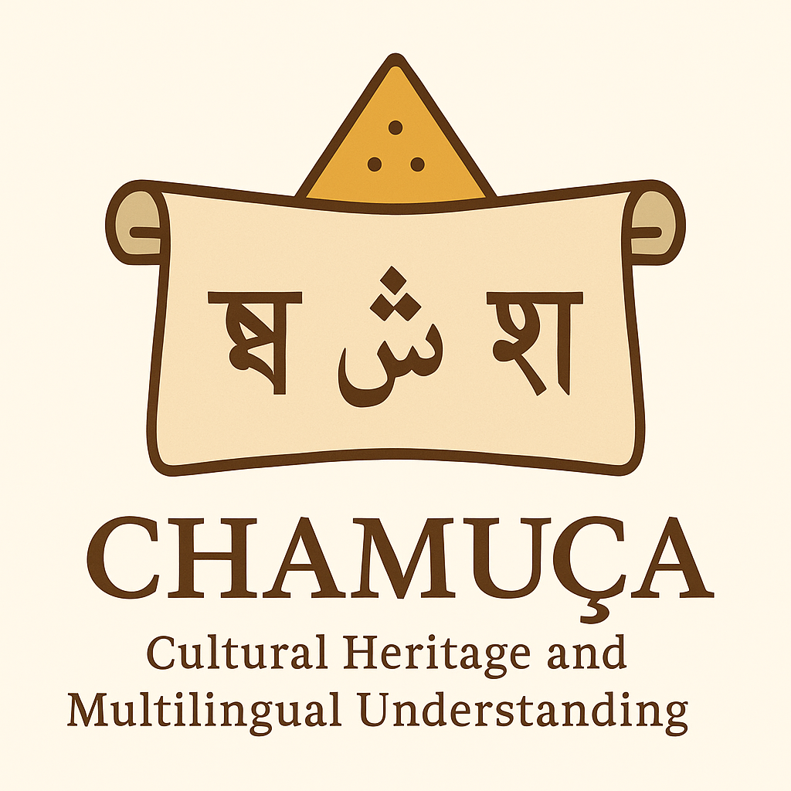

# Cultural HeritAge and Multilingual Understanding through lexiCal Archives (CHAMUÇA)

## Table of Contents

- [Summary](#summary)
- [Introduction](#introduction)
- [Background](#background)
  - [The Impact of Portuguese in Asia](#the-impact-of-portuguese-in-asia)
- [Dalgado and the _Influência do Vocabulário Português em Línguas Asiáticas_](#dalgado-and-the-influência-do-vocabulário-português-em-línguas-asiáticas)
  - [Languages Covered by Dalgado's Lexicon](#languages-covered-by-dalgados-lexicon)
- [CHAMUÇA as an Open, Crowd-Resourced Dataset](#chamuça-as-an-open-crowd-resourced-dataset)
- [Adding a Language to CHAMUÇA](#adding-a-language-to-chamuça)
  - [Adding Corpus Information](#adding-corpus-information)
- [Update: Languages We Have Covered or Plan to Cover](#update-languages-we-have-covered-or-plan-to-cover)
  - [Hindi/Urdu](#hindiurdu)
  - [Punjabi](#punjabi)
  - [Assamese](#assamese)
  - [Konkani](#konkani)
  - [Bengali](#bengali)
  - [Sinhalese](#sinhalese)
  - [Malayalam](#malayalam)
  - [Tamil](#tamil)
  - [Indonesian](#indonesian)
- [Producing a Wikisource Edition of Dalgado's Lexicon](#producing-a-wikisource-edition-of-dalgados-lexicon)
- [How You Can Collaborate?](#how-you-can-collaborate)
  - [Collaborators](#collaborators)
- [References](#references)
  - [Source Works](#source-works)
  - [Works Where the Project Is Described](#works-where-the-project-is-described)
- [Contact](#contact)

## Summary 
The current document describes the Chamuça project, its aim and the current state of its progress. It will also describe the language resource of the same name, which is one of the products of the project, how it is structured and how to access it. It also provides information on how to contribute to the project and the resource. 

## Introduction

**Cultural HeritAge and Multilingual Understanding through lexiCal Archives (CHAMUÇA)** is an interdisciplinary project in historical contact linguistics that seeks to document the influence of Portuguese on Asian languages while making earlier scholarship on the topic more accessible.  

CHAMUÇA is also the name of the linguistic resource produced by the project. The resource is being released in successive RDF versions as a linguistic knowledge graph, serving as a case study for the use of **linguistic linked data** in the dissemination of cultural and linguistic heritage. The project name additionally recalls the well-known fried snack *chamuça*, itself an example of intercultural exchange.

At the time of writing (20/11/25), the first version of CHAMUÇA includes Portuguese borrowings in Urdu, Hindi, and Punjabi. The current focus is on South Asian and Malaysian/Indonesian languages, with plans to expand coverage in the future.

The project has several main objectives:
- To represent the history of Portuguese lexical influence in a machine-actionable and accessible form through a knowledge graph containing separate Asian-language lexicons and an indexical Portuguese lexicon;
- To model the data in RDF using the OntoLex-Lemon framework, provide access through a SPARQL endpoint, and publish it openly as part of the linguistic linked open data cloud;
- To integrate lexical information from multiple sources, including Wiktionary, Wikipedia, lexicographic works, and especially Dalgado’s 1913 study;
- To extract and compare data from Dalgado’s lexicon with contemporary resources, making his scholarship more accessible to researchers and the wider public.

## Background
### The Impact of Portuguese in Asia

The influence of Portuguese in Asia began during the so-called Age of Discovery (*Era dos Descobrimentos*) in the 15th and 16th centuries. During this period, Portuguese sailors and colonists established a network of trading posts and settlements along the South Asian coast, beginning with the Malabar Coast and extending to places such as Cochin and Calicut.

These early footholds later expanded into a wider commercial and colonial network across Asia. As a result, **Portuguese became an important language of trade and diplomacy in the region**. As Cardoso (2016) observes: “A língua portuguesa encaixou-se na região asiática ao ponto de se converter em importante língua franca de comércio e diplomacia” [The Portuguese language became so embedded in the Asian region that it developed into an important lingua franca of commerce and diplomacy].

Portuguese subsequently influenced many Asian languages, first on the western coast of India and later in Sri Lanka, Bengal, Indonesia, China, and Japan. This linguistic legacy remains visible today, even if it often goes unrecognized by speakers.

CHAMUÇA aims to make this history more visible and accessible to both researchers and the general public by tracing the legacy of trade and colonisation through the vocabularies of modern Asian languages. Another important goal of the project is to highlight the pioneering scholarship of Sebastião Rodolfo Dalgado.

## Dalgado and the _Influência do Vocabulário Português em Línguas Asiáticas_

Sebastião Rodolfo Dalgado was a Portuguese Catholic priest, linguist, and orientalist born in Goa, in 1855, when it was still under Portuguese rule. Combining Indo-Portuguese cultural knowledge with European philological training, he became a leading scholar of Portuguese linguistic influence in Asia.

Dalgado’s most important contribution was his pioneering research on Portuguese lexical borrowings in Asian languages. At a time when the linguistic effects of European colonialism in Asia had received little scholarly attention, his work helped establish the field now known as *Luso-Asian contact linguistics*.

### Languages Covered by Dalgado's Lexicon
Dalgado's work covers the following (we use Soares' names for these languages, translated from the original Portuguese of Dalgado):  

[Achinese or Atjeh](https://www.wikidata.org/wiki/Q34447),  [Anglo-Indian](https://www.wikidata.org/wiki/Q56725),  [Annamite or Annamese](https://www.wikidata.org/wiki/Q9192),  [Arabic](https://www.wikidata.org/wiki/Q56475),  [Assamese](https://www.wikidata.org/wiki/Q29401),  [Balinese](https://www.wikidata.org/wiki/Q33025),  [Batavian](https://www.wikidata.org/wiki/Q49228),  [Batta or Batak](https://www.wikidata.org/wiki/Q33070),  [Bengali](https://www.wikidata.org/wiki/Q9610),  [Bugui](https://www.wikidata.org/wiki/Q3507951),  [Burmese](https://www.wikidata.org/wiki/Q9228),  [Chinese](https://www.wikidata.org/wiki/Q7850),  [Dayak](https://www.wikidata.org/wiki/Q58494757),  [Galoli](https://www.wikidata.org/wiki/Q551569),  [Garo](https://www.wikidata.org/wiki/Q35756),  [Gujarati](https://www.wikidata.org/wiki/Q5137),  [Hindi](https://www.wikidata.org/wiki/Q1568),  [Hindustani](https://www.wikidata.org/wiki/Q11051)*,  [Indo-French](https://www.wikidata.org/wiki/Q16992183),  [Japanese](https://www.wikidata.org/wiki/Q5287),  [Javanese](https://www.wikidata.org/wiki/Q33549),  [Kambojan](https://www.wikidata.org/wiki/Q9205),  [Kanarese](https://www.wikidata.org/wiki/Q33673),  [Kashmiri](https://www.wikidata.org/wiki/Q33552),  [Khassi](https://www.wikidata.org/wiki/Q33578),  [Konkani](https://www.wikidata.org/wiki/Q33946),  [Laskhari-Hindustani](https://www.wikidata.org/wiki/Q11051),  [Macassar](https://www.wikidata.org/wiki/Q33614),  [Madurese](https://www.wikidata.org/wiki/Q33723),  [Malagasy](https://www.wikidata.org/wiki/Q7930),  [Malay](https://www.wikidata.org/wiki/Q9237),  [Malayalam](https://www.wikidata.org/wiki/Q36236),  [Marathi](https://www.wikidata.org/wiki/Q1571),  [Molucan](https://www.wikidata.org/wiki/Q33475),  [Nepali](https://www.wikidata.org/wiki/Q33823),  [Nicobarese](https://www.wikidata.org/wiki/Q702939),  [Oriya](https://www.wikidata.org/wiki/Q33810),  [Panjabi](https://www.wikidata.org/wiki/Q58635),  [Persian](https://www.wikidata.org/wiki/Q9168),  [Pidgin-English](https://www.wikidata.org/wiki/Q42365),  [Rabbinical](https://www.wikidata.org/wiki/Q178440),  [Siamese](https://www.wikidata.org/wiki/Q9217),  [Sindhi](https://www.wikidata.org/wiki/Q33997),  [Sinhalese](https://www.wikidata.org/wiki/Q13267),  [Sundanese](https://www.wikidata.org/wiki/Q34002),  [Tamil](https://www.wikidata.org/wiki/Q5885),  [Telugu](https://www.wikidata.org/wiki/Q8097),  [Teto](https://www.wikidata.org/wiki/Q3547832),  [Tibetan](https://www.wikidata.org/wiki/Q34271),  [Tonkinese](https://www.wikidata.org/wiki/Q9192),  [Tulu](https://www.wikidata.org/wiki/Q34211),  [Turkish](https://www.wikidata.org/wiki/Q256).  

*By Hindustani Dalgado refers to what we nowadays call Urdu. To quote Dalgado (in Soares' translation): "It is true that both terms Urdu and Hindustani are used promiscuously, but Urdu denotes properly speaking, the form of the literary language, purer and more polished, and Hindustani, the common speech diluted by the admixture of exotic words".

## CHAMUÇA as an open, crowd-resourced dataset
The CHAMUÇA project took inspiration from the linguistic scholarship carried out by Dalgado with the aim of making this scholarship more accessible both to human beings and to machines. Indeed, our goal is not only to make Dalgado's work in this area accessible to a wider audience (including non-specialists), but to do the same thing for other scholarship in this area. Much of the scholarship that has been carried out in what we have termed Luso-Asian contact linguistics is only available in Portuguese or only in other languages and often only in paper format. And much of it is available in scattered resources ('silos'), without a single access point, and often in a format that is diffcult to process and not interoperable with other relevant resources.  

Overall then, our goals in initiating the project were the following: 
- Make Dalgado's work accessible in a machine readable form, as a **Findable Accesssible Interoperable and Reusable** (FAIR) dataset[^1] using already existing standards and technologies whenever possible and with an open license; part of this is a publication of Dalgado's lexicon as a (proof checked) Wikisource edition;
- Add entries not
- We also aim to enrich Dalgado's work by comparing it with other lexicographic and scholarly resources; we would also eventually open like to open up our resource up to crowdsourcing;
- We were also interested in seeing how such a resource could be made available via linked data, which we see as a fitting technology which is potentially very suitable for this task (we describe this in the following section).

In a first stage of the project we would like to work on the following languages (due to the expertise of the initial partecipants to the project):
**Bengali, Gujarati, Hindi, Urdu, Indonesian, Konkani, Malay, Panjabi, Sinhalese, Tamil, Telegu.**

#### Accessing the CHAMUÇA SPARQL Endpoint

The SPARQL endpoint can be accessed [here](https://anasfkhan81.github.io/chamuca_lexical_resource/).

## Adding a language to CHAMUÇA

The idea is for each language to have the following information for each potential Portuguese borrowing. 

| Category | Description |
| -------- | ------- |
| Etymon pt-PT | One or more original Portuguese etymons | 
| Headword | Lemma in word in question (using original alphabet(s)) |
| Transliteration | A transliteration of the lemma |
| Pronunciation | The pronunciation of the word in IPA |
| Etymology Free | A string describing the etymological origin of the |
| Dalgado | The lemmas as it appears in Dalgado's work (if it appears there) |
| Part of Speech, Gender, etc | Standard grammatical information |
| Wiktionary | A link to a corresponding wiktionary entry (if it exists)|
| Example | An example sentence using the word |
| Source | Source of the word (as borrowed from Portuguese) |
| Domain | The domain to which the word belongs |
| Synonyms | Synonymous words|
| Grammar | Additional grammatical information|

### Adding Corpus Information

# Update: Languages we have covered or plan to cover
### Hindi/Urdu
Hindi

Count: 89

All Hindi lemmas and their (hypothesised) Portuguese etymons:

[Run Hindi → Portuguese SPARQL query (text)](https://lari-datasets.ilc.cnr.it/chamuca/query?query=PREFIX%20ontolex%3A%20%3Chttp%3A%2F%2Fwww.w3.org%2Fns%2Flemon%2Fontolex%23%3E%0APREFIX%20lexinfo%3A%20%3Chttp%3A%2F%2Fwww.lexinfo.net%2Fontology%2F2.0%2Flexinfo%23%3E%0A%0ASELECT%20%3FhindiWordConcat%20%3FportugueseWord%20WHERE%20%7B%0A%0A%20%20%7B%0A%20%20%20%20SELECT%20%3FhEntry%20%28GROUP_CONCAT%28STR%28%3FhindiWord%29%3B%20SEPARATOR%3D%22%20%2F%20%22%29%20AS%20%3FhindiWordConcat%29%20WHERE%20%7B%0A%20%20%20%20%20%20GRAPH%20%3Chttps%3A%2F%2Flari-datasets.ilc.cnr.it%2Fchamuca_hi_lex%3E%20%7B%0A%20%20%20%20%20%20%20%20%3FhEntry%20ontolex%3AcanonicalForm%2Fontolex%3AwrittenRep%20%3FhindiWord%20.%0A%20%20%20%20%20%20%7D%0A%20%20%20%20%7D%0A%20%20%20%20GROUP%20BY%20%3FhEntry%0A%20%20%7D%0A%0A%20%20GRAPH%20%3Chttps%3A%2F%2Flari-datasets.ilc.cnr.it%2Fchamuca_hi_lex%3E%20%7B%0A%20%20%20%20%3FhEntry%20a%20ontolex%3ALexicalEntry%20%3B%0A%20%20%20%20%20%20lexinfo%3AetymologicalRoot%20%3FptID%20.%0A%20%20%7D%0A%0A%20%20GRAPH%20%3Chttps%3A%2F%2Flari-datasets.ilc.cnr.it%2Fchamuca_pt_lex%3E%20%7B%0A%20%20%20%20%3FptID%20ontolex%3AcanonicalForm%2Fontolex%3AwrittenRep%20%3FportugueseWord%20.%0A%20%20%7D%0A%7D&output=text)

[Run Hindi → Portuguese SPARQL query (CSV)](https://lari-datasets.ilc.cnr.it/chamuca/query?query=PREFIX%20ontolex%3A%20%3Chttp%3A%2F%2Fwww.w3.org%2Fns%2Flemon%2Fontolex%23%3E%0APREFIX%20lexinfo%3A%20%3Chttp%3A%2F%2Fwww.lexinfo.net%2Fontology%2F2.0%2Flexinfo%23%3E%0A%0ASELECT%20%3FhindiWordConcat%20%3FportugueseWord%20WHERE%20%7B%0A%0A%20%20%7B%0A%20%20%20%20SELECT%20%3FhEntry%20%28GROUP_CONCAT%28STR%28%3FhindiWord%29%3B%20SEPARATOR%3D%22%20%2F%20%22%29%20AS%20%3FhindiWordConcat%29%20WHERE%20%7B%0A%20%20%20%20%20%20GRAPH%20%3Chttps%3A%2F%2Flari-datasets.ilc.cnr.it%2Fchamuca_hi_lex%3E%20%7B%0A%20%20%20%20%20%20%20%20%3FhEntry%20ontolex%3AcanonicalForm%2Fontolex%3AwrittenRep%20%3FhindiWord%20.%0A%20%20%20%20%20%20%7D%0A%20%20%20%20%7D%0A%20%20%20%20GROUP%20BY%20%3FhEntry%0A%20%20%7D%0A%0A%20%20GRAPH%20%3Chttps%3A%2F%2Flari-datasets.ilc.cnr.it%2Fchamuca_hi_lex%3E%20%7B%0A%20%20%20%20%3FhEntry%20a%20ontolex%3ALexicalEntry%20%3B%0A%20%20%20%20%20%20lexinfo%3AetymologicalRoot%20%3FptID%20.%0A%20%20%7D%0A%0A%20%20GRAPH%20%3Chttps%3A%2F%2Flari-datasets.ilc.cnr.it%2Fchamuca_pt_lex%3E%20%7B%0A%20%20%20%20%3FptID%20ontolex%3AcanonicalForm%2Fontolex%3AwrittenRep%20%3FportugueseWord%20.%0A%20%20%7D%0A%7D&output=csv)

Urdu

Count: 53

[Run Urdu → Portuguese SPARQL query (text)](https://lari-datasets.ilc.cnr.it/chamuca/query?query=PREFIX%20ontolex%3A%20%3Chttp%3A%2F%2Fwww.w3.org%2Fns%2Flemon%2Fontolex%23%3E%0APREFIX%20lexinfo%3A%20%3Chttp%3A%2F%2Fwww.lexinfo.net%2Fontology%2F2.0%2Flexinfo%23%3E%0A%0ASELECT%20%3FurduWordConcat%20%3FportugueseWord%20WHERE%20%7B%0A%0A%20%20%7B%0A%20%20%20%20SELECT%20%3FuEntry%20%28GROUP_CONCAT%28STR%28%3FurduWord%29%3B%20SEPARATOR%3D%22%20%2F%20%22%29%20AS%20%3FurduWordConcat%29%20WHERE%20%7B%0A%20%20%20%20%20%20GRAPH%20%3Chttps%3A%2F%2Flari-datasets.ilc.cnr.it%2Fchamuca_ur_lex%3E%20%7B%0A%20%20%20%20%20%20%20%20%3FuEntry%20ontolex%3AcanonicalForm%2Fontolex%3AwrittenRep%20%3FurduWord%20.%0A%20%20%20%20%20%20%7D%0A%20%20%20%20%7D%0A%20%20%20%20GROUP%20BY%20%3FuEntry%0A%20%20%7D%0A%0A%20%20GRAPH%20%3Chttps%3A%2F%2Flari-datasets.ilc.cnr.it%2Fchamuca_ur_lex%3E%20%7B%0A%20%20%20%20%3FuEntry%20a%20ontolex%3ALexicalEntry%20%3B%0A%20%20%20%20%20%20lexinfo%3AetymologicalRoot%20%3FptID%20.%0A%20%20%7D%0A%0A%20%20GRAPH%20%3Chttps%3A%2F%2Flari-datasets.ilc.cnr.it%2Fchamuca_pt_lex%3E%20%7B%0A%20%20%20%20%3FptID%20ontolex%3AcanonicalForm%2Fontolex%3AwrittenRep%20%3FportugueseWord%20.%0A%20%20%7D%0A%7D&output=text)

[Run Urdu → Portuguese SPARQL query (CSV)](https://lari-datasets.ilc.cnr.it/chamuca/query?query=PREFIX%20ontolex%3A%20%3Chttp%3A%2F%2Fwww.w3.org%2Fns%2Flemon%2Fontolex%23%3E%0APREFIX%20lexinfo%3A%20%3Chttp%3A%2F%2Fwww.lexinfo.net%2Fontology%2F2.0%2Flexinfo%23%3E%0A%0ASELECT%20%3FurduWordConcat%20%3FportugueseWord%20WHERE%20%7B%0A%0A%20%20%7B%0A%20%20%20%20SELECT%20%3FuEntry%20%28GROUP_CONCAT%28STR%28%3FurduWord%29%3B%20SEPARATOR%3D%22%20%2F%20%22%29%20AS%20%3FurduWordConcat%29%20WHERE%20%7B%0A%20%20%20%20%20%20GRAPH%20%3Chttps%3A%2F%2Flari-datasets.ilc.cnr.it%2Fchamuca_ur_lex%3E%20%7B%0A%20%20%20%20%20%20%20%20%3FuEntry%20ontolex%3AcanonicalForm%2Fontolex%3AwrittenRep%20%3FurduWord%20.%0A%20%20%20%20%20%20%7D%0A%20%20%20%20%7D%0A%20%20%20%20GROUP%20BY%20%3FuEntry%0A%20%20%7D%0A%0A%20%20GRAPH%20%3Chttps%3A%2F%2Flari-datasets.ilc.cnr.it%2Fchamuca_ur_lex%3E%20%7B%0A%20%20%20%20%3FuEntry%20a%20ontolex%3ALexicalEntry%20%3B%0A%20%20%20%20%20%20lexinfo%3AetymologicalRoot%20%3FptID%20.%0A%20%20%7D%0A%0A%20%20GRAPH%20%3Chttps%3A%2F%2Flari-datasets.ilc.cnr.it%2Fchamuca_pt_lex%3E%20%7B%0A%20%20%20%20%3FptID%20ontolex%3AcanonicalForm%2Fontolex%3AwrittenRep%20%3FportugueseWord%20.%0A%20%20%7D%0A%7D&output=csv)

### Punjabi
Status: All words covered

### Assamese
### Konkani
### Bengali
### Sinhalese
### Malayalam
### Tamil
### Indonesian 

### Producing a Wikisource Edition of Dalgado's Lexicon

## How you can collaborate?
As of the time of writing, the best way of participating, both in terms of enriching a particular lexicon or in starting a new one is to contact: fahad.khan@ilc.cnr.it
### Collaborators
TBF

## References
### Source Works
- Dalgado, Sebastião Rodolfo (1913): Influência do Vocabulário Português em Línguas Asiáticas. Imprensa da Universidade de Coimbra.
- Soares, Anthony Xavier (1936): Portuguese Vocables In Asiatic Languages:  from the Portuguese original of Sebastião Rodolfo Dalgado. Baroda: Oriental Institute.

### Works where the project is described 
- Khan, Anas Fahad, Maxim Ionov, Paola Marongiu & Ana Salgado (2025): A Lightweight String Based Method of Encoding Etymologies in Linked Data Lexical Resources. In Katerina Gkirtzou, Slavko Žitnik, Jorge Gracia, Dagmar Gromann, Maria Pia di Buono, Johanna Monti & Maxim Ionov (Hrsg.), Proceedings of the 5th Conference on Language, Data and Knowledge: The 5th OntoLex Workshop, 30–34. Naples, Italy: Unior Press.
- Khan, Fahad, Ana Salgado, Isuri Anuradha, Rute Costa, Chamila Liyanage, John P. McCrae, Atul Kr. Ojha, Priya Rani & Francesca Frontini (2024a): CHAMUÇA: Towards a Linked Data Language Resource of Portuguese Borrowings in Asian Languages. In Christian Chiarcos, Katerina Gkirtzou, Maxim Ionov, Fahad Khan, John P. McCrae, Elena Montiel Ponsoda & Patricia Martín Chozas (Hrsg.), Proceedings of the 9th Workshop on Linked Data in Linguistics @ LREC-COLING 2024, 44–48. Torino, Italia: ELRA and ICCL.
- Khan, Fahad, Ana Salgado, John McCrae, Chamila Liyange, Priya Rani, Rute Costa, Isuri Anuradha, Atul Ojha & Francesca Frontini (2024b): Cultural heritage and multilingual understanding through lexical archives (CHAMUÇA). Lexicography and Semantics. Proceedings of the XXI EURALEX International Congress.

### Contact
Please email fahad.khan@ilc.cnr.it

[^1]:See [https://www.go-fair.org/fair-principles/](https://www.go-fair.org/fair-principles/)
[^2]: Add link with more information on linked open data
